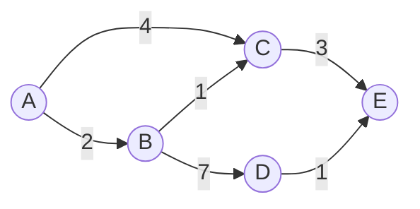
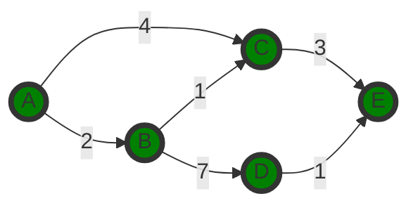

# Matrices and Graphs

**Author: Shekh Mostofa Abedin**

## Matrices

#### Scalar Multiplication

- **Operation**: Multiply each element of the matrix by a scalar (a single number).

  - **Example**:

    ```
    C = | 1  2  3 |, Scalar = 2

    2 * C = | 2*1  2*2  2*3 | = | 2  4  6 |
            | 2*4  2*5  2*6 |   | 8  10 12 |
            | 2*7  2*8  2*9 |   | 14 16 18 |
    ```

#### c. Matrix Multiplication (Dot Product)

- **Condition**: The number of columns in the first matrix must equal the number of rows in the second matrix.
- **Operation**: Multiply the rows of the first matrix by the columns of the second matrix and sum the products.

  - **Example**:

    ```
    A = | 1  2 |       B = | 5  6 |
        | 3  4 |           | 7  8 |

    A * B = | 1*5 + 2*7   1*6 + 2*8 | = | 19  22 |
            | 3*5 + 4*7   3*6 + 4*8 |   | 43  50 |
    ```

#### d. Transpose of a Matrix

- **Operation**: Flip the matrix over its diagonal, converting rows to columns and vice versa.

  - **Example**:

    ```
    A = | 1  2  3 |
        | 4  5  6 |

    A^T = | 1  4 |
          | 2  5 |
          | 3  6 |
    ```

---

## Graphs

### 1. Graph Basics

- **Definition**: A graph consists of nodes (or vertices) connected by edges.
- **Types of Graphs**:
  - **Directed vs. Undirected**: In a directed graph, edges have a direction (e.g., A -> B), whereas in an undirected graph, edges do not have a direction.
  - **Weighted vs. Unweighted**: A weighted graph has edges with associated values (weights), while an unweighted graph does not.

### 2. Graph Representations

#### a. Adjacency Matrix

- **Definition**: A square matrix used to represent a finite graph, where the element at row `i` and column `j` indicates the presence (and weight) of an edge between vertices `i` and `j`.

  - **Example** (Unweighted Graph):

    ```
    A = | 0  1  0 |
        | 1  0  1 |
        | 0  1  0 |
    ```

    Here, vertex 1 is connected to vertex 2, and vertex 2 is connected to vertex 3.

  - **Example** (Weighted Graph):
    ```
    B = | 0  5  0 |
        | 5  0  3 |
        | 0  3  0 |
    ```
    Here, the weight of the edge between vertices 1 and 2 is 5, and between vertices 2 and 3 is 3.

#### b. Edge List

- **Definition**: A list of edges, where each edge is represented as a pair of vertices.
  - **Example**:
    ```
    Edge List: [(1, 2), (2, 3)]
    ```
    This list represents the connections between vertices.

#### c. Adjacency List

- **Definition**: A collection of lists, with each list corresponding to a vertex and containing the vertices adjacent to it.
  - **Example**:
    ```
    Adjacency List:
    1: [2]
    2: [1, 3]
    3: [2]
    ```
    Here, vertex 1 is connected to vertex 2, vertex 2 is connected to vertices 1 and 3, and vertex 3 is connected to vertex 2.

### 3. Graph Algorithms

#### Dijkstra’s Algorithm

- **Purpose**: Finds the shortest path between a starting node and all other nodes in a weighted graph.
- **Steps**:

1. Start with the initial node, assigning it a tentative distance of 0 and all other nodes a distance of infinity.
2. Set the current node as the node with the smallest tentative distance.
3. Update the tentative distance for all adjacent nodes.
4. Mark the current node as visited and move to the next unvisited node with the smallest distance.
5. Repeat until all nodes have been visited.

#### Dijkstra’s Algorithm Example

#### Problem

We have the following weighted graph, and we want to find the shortest path from node A to all other nodes.

#### Graph Representation



Steps

1. Initialization
   Set the tentative distance to the starting node (A) as 0. Set the distance to all other nodes as infinity (∞).

```yaml
A: 0, B: ∞, C: ∞, D: ∞, E: ∞
```

2. Visit Node A
   Consider all neighbors of A (B and C). Update the tentative distances for B and C.

```vbnet
Distance to B: 0 + 2 = 2 (from A)
Distance to C: 0 + 4 = 4 (from A)
```

Updated Distances:

```yaml
A: 0, B: 2, C: 4, D: ∞, E: ∞
```

3. Visit Node B (smallest tentative distance)
   Consider all neighbors of B (C and D). Update the tentative distances for C and D.

```vbnet
Distance to C: min(4, 2 + 1) = 3 (from B)
Distance to D: 2 + 7 = 9 (from B)
```

Updated Distances:

```yaml
A: 0, B: 2, C: 3, D: 9, E: ∞
```

4. Visit Node C (smallest tentative distance)
   Consider all neighbors of C (E). Update the tentative distance for E.

```mathematica
Distance to E: 3 + 3 = 6 (from C)
```

Updated Distances:

```yaml
A: 0, B: 2, C: 3, D: 9, E: 6
```

5. Visit Node E (smallest tentative distance)
   Consider all neighbors of E. No updates are needed since visiting D from E (6 + 1 = 7) does not improve the distance to D.

Updated Distances:

```yaml
A: 0, B: 2, C: 3, D: 7, E: 6
```

6. Visit Node D
   All nodes have now been visited. The algorithm is complete.

Final Shortest Distances

```yaml
A: 0, B: 2, C: 3, D: 7, E: 6
```


